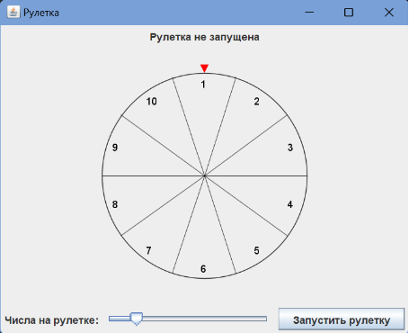
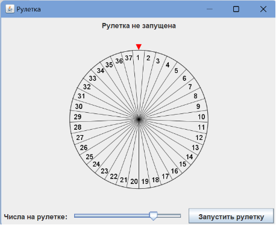
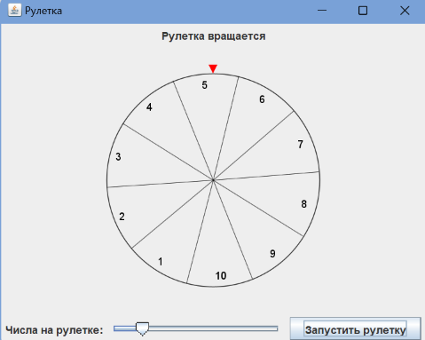
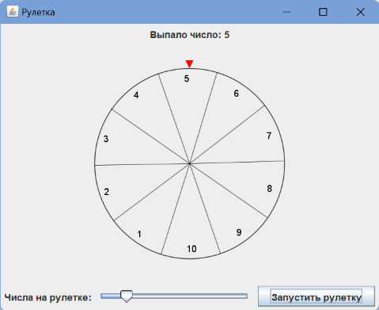



**Лабораторная работа №1**

**по дисциплине «Инжиниринг программного обеспечения»**

Графический интерфейс с динамической разметкой.

Факультет: АВТФ

Группа: АВТ-141

Студенты: Кенин Е.Д., Половин Н.В.

Вариант: 9

Преподаватель: Романов Е.Л.

**Содержание**

[1.	Описание работы	3](#_toc179642667)

[2.	Описание паттернов	4](#_toc179642668)

[3.	Функциональное описание классов	5](#_toc179642669)

[4.	Результаты работы	8](#_toc179642670)

[5.	Вывод	10](#_toc179642671)

1. # **Описание работы**
Разработать графический интерфейс с программируемой разметкой: переменное количество элементов, их расположение и перемещение, регулярная обработка событий.

«Рулетка» - вращающееся колесо числами или иконками. При остановке выводится выпадающее число или иконка. При отсутствии средств поворота изображения перемещать горизонтально расположенное текстовое поле с числом или иконку по дуге окружности. Реалистичная анимация вращения с постепенной остановкой.
1. # **Описание паттернов**
В данном приложении используются следующие паттерны проектирования:

**Model-View-Controller (MVC):**

- **Model:** RouletteModel отвечает за логику рулетки и обработку данных.
- **View:** RouletteView отображает интерфейс и визуальные компоненты.
- **Controller:** RouletteController координирует взаимодействие между моделью и представлением, связывая логику с интерфейсом.

  **Observer:** Используется в RouletteController, где представление подписывается на события модели (например, изменение числа слайдером), что позволяет обновлять интерфейс при изменении состояния.

1. # **Функциональное описание классов**
В программе используется 5 классов: RouletteApp, RouletteModel, RouletteComponent, RouletteView, RouletteController

1. **RouletteApp** 

Описание класса: Главная точка входа в приложение, отвечает за инициализацию и запуск интерфейса.

Методы:

***main(String[] args)***: Создает экземпляры модели, вида и контроллера, инициализирует графическое окно и отображает его.

1. **RouletteModel** 

Описание класса: Логическая часть, отвечающая за управление данными (количество чисел на рулетке) и генерацию случайного результата вращения.

Переменные:

***int numberCount***: Количество чисел на рулетке. По умолчанию 10.

Методы:

***setNumberCount(int count)***: Устанавливает количество чисел на рулетке.

***getNumberCount()***: Возвращает текущее количество чисел.

***spin()***: Генерирует случайное число в пределах от 1 до количества чисел на рулетке (эмулирует результат вращения).

2. **RouletteComponent** 

Описание класса: Графический компонент, отвечающий за отрисовку рулетки и выполнение анимации вращения.

Переменные:

***int currentAngle***: Текущий угол вращения рулетки.

***int targetAngle***: Угол, на котором остановится рулетка.

***int numberCount***: Количество чисел на рулетке.

***int[] numbers***: Массив чисел, отображаемых на рулетке.

***Runnable onSpinEnd***: Callback-функция, вызываемая после завершения вращения.

Методы:

***RouletteComponent()***: Инициализирует компонент рулетки, устанавливает размер и количество чисел.

***updateNumbers(int numberCount)***: Обновляет количество чисел на рулетке.

***setOnSpinEnd(Runnable onSpinEnd)***: Устанавливает функцию, вызываемую после завершения вращения.

***startSpin(int targetNumber)***: Запускает анимацию вращения рулетки с заданным целевым числом.

***paintComponent(Graphics g)***: Отрисовывает рулетку, ее элементы и текущий угол вращения.

1. **RouletteView** 

Описание класса: Интерфейс пользователя, содержит визуальные компоненты (рулетка, кнопка, слайдер и метки).

Переменные:

***JLabel label***: Метка, отображающая статус или результат рулетки.

***JSlider slider***: Слайдер для выбора количества чисел на рулетке (от 2 до 50).

***JButton startButton***: Кнопка для запуска вращения рулетки.

***RouletteComponent rouletteComponent***: Компонент, отвечающий за визуализацию рулетки.

Методы:

***RouletteView()***: Создает и настраивает компоненты интерфейса, задает макет и добавляет компоненты в окно.

***getSlider()***: Возвращает объект слайдера для изменения количества чисел.

***getStartButton()***: Возвращает объект кнопки для запуска рулетки.

***setSpin()***: Устанавливает текст метки как "Рулетка вращается".

***setResult(int result)***: Устанавливает текст метки с результатом вращения.

***getRouletteComponent()***: Возвращает компонент рулетки для взаимодействия.

1. **RouletteController** 

Описание класса: Логика взаимодействия между моделью и представлением. Обрабатывает пользовательские действия и обновляет интерфейс в зависимости от логики приложения.

Методы:

***RouletteController(RouletteModel model, RouletteView view)***: Инициализирует контроллер, добавляет слушатели на слайдер и кнопку запуска.

4. # **Результаты работы**

Рисунок 1. Интерфейс программы при запуске

Рисунок 2. Интерфейс программы при изменении количества чисел

Рисунок 3. Интерфейс программы при вращении рулетки

Рисунок 3. Интерфейс программы при выпадении числа
4. # **Вывод**
В ходе выполнения практической работы были выполнены следующие задачи:

- Разработан графический интерфейс для игры "Рулетка", включая визуализацию вращающегося колеса и элементов управления (кнопки, слайдер).
- Реализована логика рулетки, позволяющая выбирать случайное число при вращении.
- Осуществлена обработка событий: изменение количества чисел с помощью слайдера и запуск вращения через кнопку.
- Реализована анимация вращения колеса с визуальной обратной связью.

  Разработанное приложение может быть расширено, благодаря использованию паттерна MVC, что упрощает добавление новой функциональности.
2

